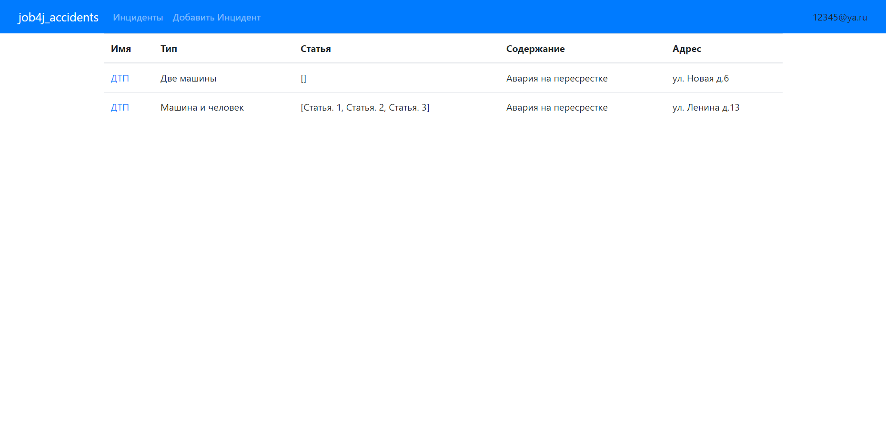
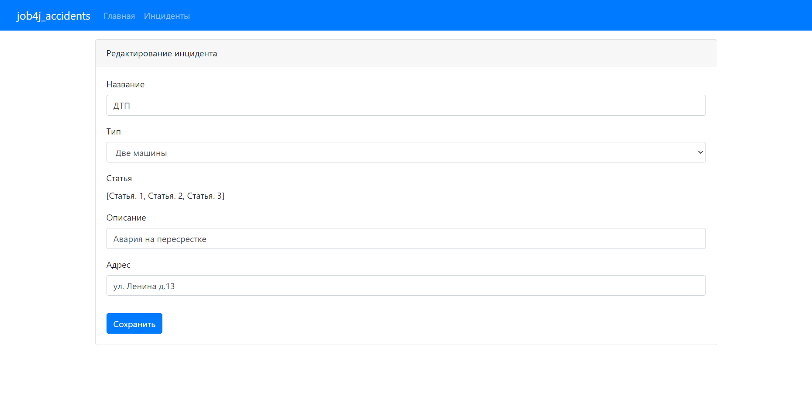
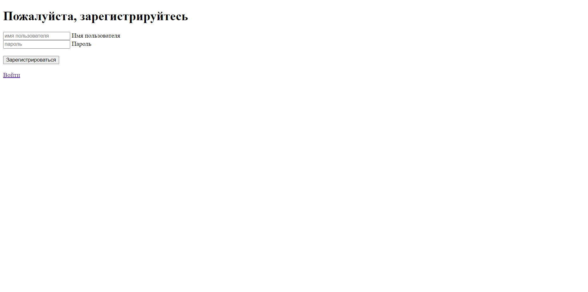
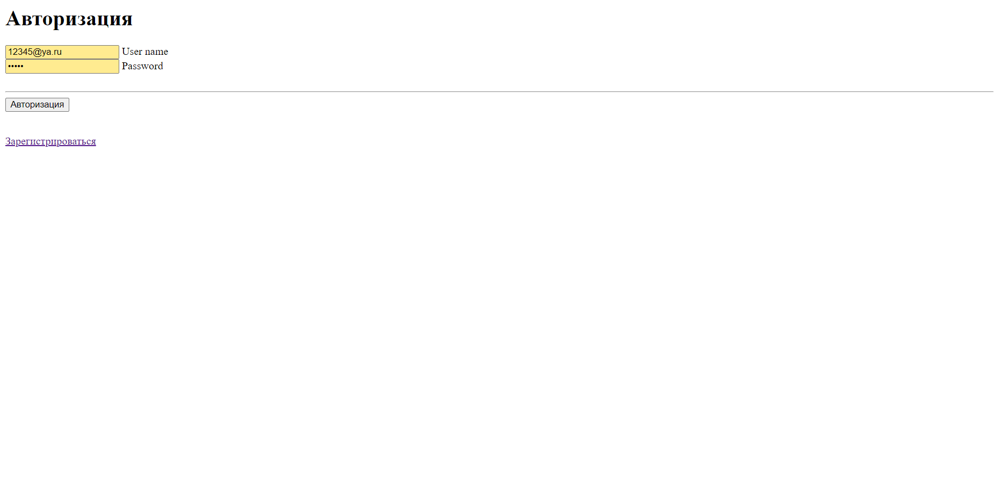

Проект - "Автонарушители" job4j_accidents
---

>Это веб приложение реализует CRUD-систему с использованием MVC шаблона.

## Содержание

- [Обшая инофмация](#Общая-информация)
- [Технологии](#Технологии)
- [Запуск проекта](#Запуск-проекта)
- [Скриншоты](#Скриншоты)
- [Контакты](#Контакты)

## Общая информация

В системе существуют две роли. Обычные пользователи и автоинспекторы.
Пользователь добавляет описание автонарушение.
В заявлении указывает: адрес, номер машины, описание нарушения и фотографию нарушения.
У заявки есть статус. Принята. Отклонена. Завершена.
Вид системы. Главная страница - это поиск с таблицей.

## Технологии

- Java 17
- Database:
    - PostgreSQL 14
    - H2
- JDBC
- Liquibase
- Hibernate
- Spring boot
- Apache TomCat
- HTML, Thymeleaf, Bootstrap
- Maven

## Запуск проекта

```
create database cars;
```
```
mvn compile;
```

## Скриншоты

#### Главная страница (Список инцидентов)

#### Страница создания инцидента

#### Страница редактирования инцидента

#### Страница Регистрации

#### Страница Авторизации



## Контакты

https://github.com/ADIKIAA